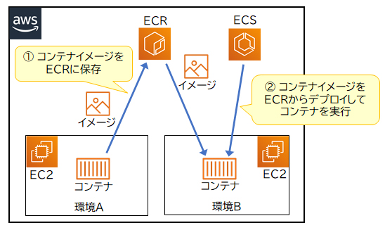
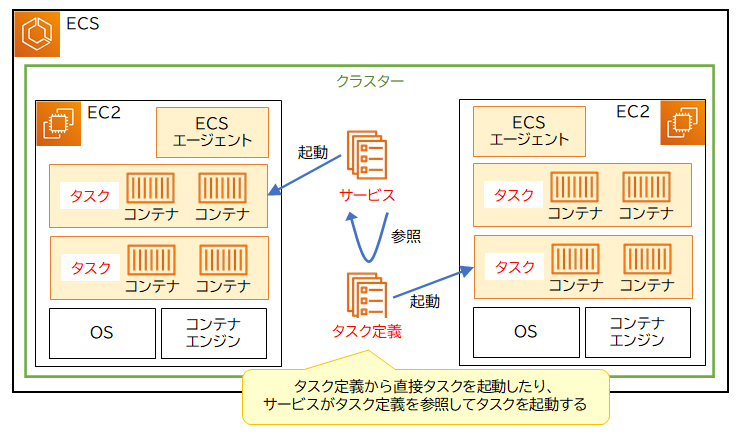

1. **Amazon ECR（Elastic Container Registry）の概要**
   - Amazon ECRは、コンテナイメージを登録・管理するためのAWSサービス。
   - コンテナイメージは、アプリケーションを実行するために必要なコードや依存関係を含んだパッケージです。

2. **ECRとECSの連携**
   - ECRに登録されたコンテナイメージは、Amazon ECS（Elastic Container Service）によって参照され、コンテナ（タスク）として起動されます。
   - この連携により、コンテナ化されたアプリケーションを効率的にデプロイ・実行できます。

3. **コンテナレジストリの定義**
   - ECRのように、コンテナイメージを登録・管理する仕組み全般を「コンテナレジストリ」と呼びます。
   - コンテナレジストリは、アプリケーションのバージョン管理やセキュアな配布に重要な役割を果たします。

この要点を押さえることで、Amazon ECRの役割とその連携先であるECSとの関係、そしてコンテナレジストリの基本的な概念を理解できます。

### 要点まとめ

1. **ECSの主要要素**
   - **クラスター**: 複数のタスクやサービスで構成される論理グループ。コンテナが動作するVPCやサブネットなどを設定します。
   - **タスク**: コンテナの実行環境を定義する要素。CPUやメモリのスペック、実行するコンテナイメージなどを設定します。
   - **サービス**: クラスター内で必要なタスク数を維持し、スケーリングやヘルスチェックなどを行います。

2. **正解**
   - **コンテナが動作するVPCやサブネット**は、ECSの「クラスター」で設定されます。

3. **その他の選択肢が誤りである理由**
   - **クラスター内で必要なタスク数**は、ECSの「サービス」で設定される。
   - **コンテナ実行環境のCPUやメモリのスペック**や**実行するコンテナイメージ**は、ECSの「タスク定義」で設定される。

この要点を理解することで、Amazon ECSにおけるクラスター、タスク、サービスの役割と、それぞれの設定内容が明確になります。

