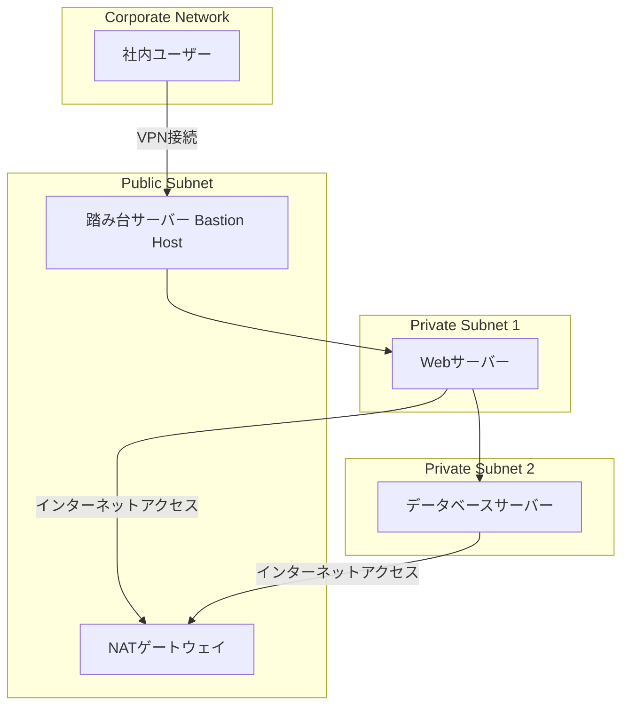

# 運用上の優位性

修正したアーキテクチャ図を以下に示します。

### 図の説明
- **Public Subnet**: 外部からアクセス可能なネットワーク領域です。ここに配置された踏み台サーバーを経由して、プライベートサブネット内のリソースにアクセスします。NATゲートウェイもここに配置され、プライベートサブネット内のリソースがインターネットにアクセスする際に利用されます。
- **Private Subnet**: 社内ネットワークからのみアクセスできる、外部から隔離されたネットワーク領域です。Webサーバーとデータベースサーバーがここに配置され、セキュリティが強化されています。
- **Corporate Network**: 社内ネットワークです。VPNを通じてプライベートサブネット内のリソースにアクセスします。

このアーキテクチャ図では、各サブネットの配置と通信経路が明確になり、セキュリティを強化するための適切な構成が示されています。