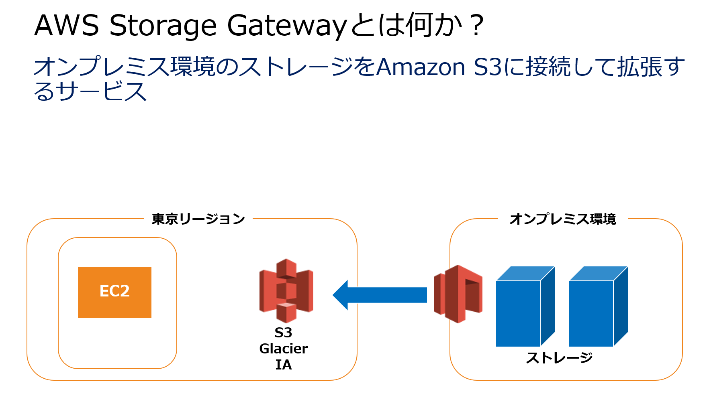
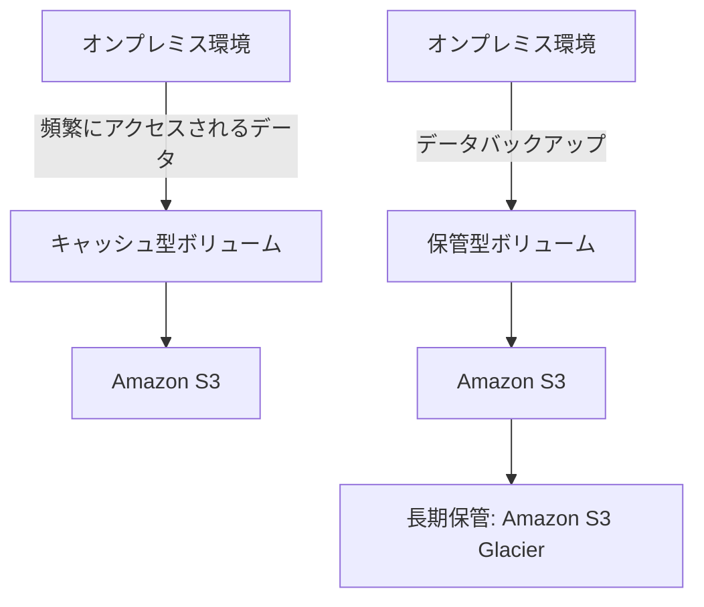

# AWS Storage Gateway

# AWS Storage Gatewayを理解して最適なソリューションを選択する

## 概要

この記事では、AWS Storage Gatewayを使ったハイブリッドクラウド構成の理解を深め、オンプレミス環境とAmazon S3の連携に関する知識を強化します。特に、キャッシュ型ボリュームと保管型ボリュームの違いや、それぞれの適用シナリオについて詳しく説明します。

## AWS Storage Gatewayとは？

AWS Storage Gatewayは、オンプレミス環境とAWSクラウドをシームレスに接続し、データのバックアップやアーカイブ、ストレージ容量の拡張を可能にするサービスです。主に以下の3つのゲートウェイタイプがあります：

1. **ファイルゲートウェイ**: 
   - ネットワークファイルシステム (NFS) やサーバーメッセージブロック (SMB) プロトコルを使用して、オンプレミスのファイルをS3に保存します。

2. **ボリュームゲートウェイ**:
   - オンプレミスのアプリケーションから見えるiSCSIデバイスを提供し、データをS3に保存します。補完型とキャッシュ型の2種類があります。

3. **テープゲートウェイ**:
   - 仮想テープライブラリー (VTL) を提供し、テープバックアップをクラウドに保存します。

---

## キャッシュ型ボリュームと保管型ボリュームの違い

### キャッシュ型ボリューム

**機能**:  
キャッシュ型ボリュームは、頻繁にアクセスされるデータをオンプレミスのキャッシュに保持し、Amazon S3をプライマリストレージとして使用します。これにより、ローカルストレージ容量を効率的に管理しながら、高速なデータアクセスを実現します。

**シナリオ**:
- **データが頻繁にアクセスされる場合**: 例えば、日々の業務で頻繁に参照するファイルやデータセットがある場合に適しています。
- **オンプレミスストレージの容量制限がある場合**: ローカルにキャッシュを保持しつつ、メインのデータはS3に保存することで、オンプレミスのストレージ負担を軽減できます。

### 保管型ボリューム

**機能**:  
保管型ボリュームは、オンプレミスにデータをプライマリとして保持し、そのデータを非同期にAmazon S3にバックアップします。オンプレミスのデータをそのまま保持しつつ、クラウドへのバックアップを行いたい場合に利用します。

**シナリオ**:
- **データのバックアップが主目的の場合**: ローカルストレージに依存しつつ、クラウドにバックアップを保存したい場合に適しています。
- **リアルタイムの高速アクセスが不要な場合**: 頻繁にアクセスしないデータを安全に保管するためのソリューションです。

---

## 選択肢の誤りの解説

### 誤答選択肢: Amazon S3 Glacier（迅速アクセス）への移転スケジュールが設定されたスナップショットを利用するキャッシュ型ボリューム

**誤りのポイント**:
- **Glacierの使用**: Amazon S3 Glacierは低コストのアーカイブストレージであり、迅速なアクセスが求められるデータには不適切です。今回の要件では頻繁にアクセスされるデータに対して迅速な応答時間を維持する必要があるため、S3 Standardを使用するほうが適切です。
- **別リージョンへのスナップショット保管**: 問題のシナリオでは、主にオンプレミスとS3間のデータ連携が求められており、リージョン間のデータ保管は要件に含まれていません。

### 正解: キャッシュ型ボリュームをAWS上に構成し、キャッシュを取得する仕組みをオンプレミス環境に設定する

**解説**:
- **キャッシュ型ボリュームの適用**: 頻繁にアクセスされるデータがキャッシュとして保持されるため、低レイテンシーでのアクセスが可能になります。S3はプライマリデータストレージとして利用され、オンプレミスの容量制限を回避できます。

---

## まとめ

### 適切なゲートウェイタイプの選択

| ゲートウェイタイプ | 用途 | 主な機能 | 適用シナリオ |
|-------------------|------|----------|--------------|
| キャッシュ型ボリューム | 頻繁にアクセスされるデータ | 高速なアクセス、オンプレミス容量の節約 | 頻繁にアクセスされるファイル |
| 保管型ボリューム | データのバックアップ | ローカルにプライマリデータを保持 | バックアップが主目的 |

---

### AWS Storage Gatewayの構成イメージ（Mermaid.js）

---

この記事を通じて、AWS Storage Gatewayのキャッシュ型ボリュームと保管型ボリュームの違いを理解し、適切な選択ができるようになったと思います。試験に向けて、これらの知識をしっかりと整理し、AWS SAAの準備を進めてください。