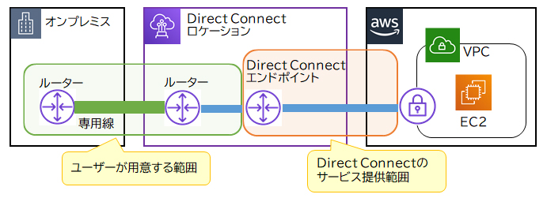

# タイトル: 高可用性を実現するためのAWS Direct ConnectとSite-to-Site VPNの冗長化構成

## はじめに

オンプレミス環境とAWSクラウド間での接続において、信頼性、低遅延、コスト効率が求められるケースでは、適切な接続方法を選択することが重要です。本記事では、**AWS Direct Connect**と**AWS Site-to-Site VPN**を組み合わせて冗長化を実現する方法について解説します。この組み合わせにより、高可用性を確保しつつ、コスト効率の高いネットワーク接続を構築することが可能です。

## 接続方法の概要

### 1. AWS Direct Connect

**AWS Direct Connect**は、オンプレミス環境からAWSクラウドに専用回線を利用して接続するサービスです。この接続はインターネットを介さずに行われるため、非常に低遅延で安定した通信が可能です。通常、企業が大量のデータをセキュアにAWSに送受信する際に利用されます。

- **主な特徴**:
  - **低遅延**: インターネット回線を使用しないため、遅延が少ない。
  - **高い信頼性**: 専用回線を使用するため、ネットワークの信頼性が高い。
  - **高コスト**: 専用回線の設置には工事費用や月額費用がかかる。

### 2. AWS Site-to-Site VPN
**AWS Site-to-Site VPN**は、オンプレミスのネットワークとAWS VPCをインターネットを介して接続するサービスです。この接続は、通常、バックアップやコスト効率の高い接続手段として利用されます。

- **主な特徴**:
  - **コスト効率**: インターネット回線を使用するため、設置コストが低い。
  - **容易な設定**: 比較的短期間で設定を完了し、接続を開始できる。
  - **高遅延**: インターネット回線を使用するため、遅延が発生しやすい。

## 冗長化の実装

企業が高可用性を実現するために、Direct ConnectとSite-to-Site VPNを組み合わせた冗長化構成が一般的に推奨されます。以下に、その構成を図解します。

### 図解の説明

1. **通常時の運用**:
   - 通常の通信はAWS Direct Connectを介して行われます。このため、低遅延かつ安定した通信が保証されます。

2. **障害時の対応**:
   - Direct Connectに障害が発生した場合、自動的にSite-to-Site VPNに切り替えます。このため、通信の継続性が確保されますが、パフォーマンスは多少低下します。

### なぜDirect Connectを通常時に使用し、VPNをバックアップにするのか？

- **低遅延を優先**: Direct Connectは専用回線を使用しており、低遅延と高い信頼性を提供します。したがって、通常時のメイン接続として適しています。
- **コスト効率のバランス**: Site-to-Site VPNはコストが低く、バックアップ回線としての役割を果たすのに適しています。これにより、高可用性を確保しつつ、コストを抑えることができます。

## その他の選択肢の検討

### 1. Site-to-Site VPNをメイン、Direct Connectをバックアップとして利用

- **問題点**: Site-to-Site VPNはインターネット回線を利用するため、通常時の通信が遅延しやすくなります。高パフォーマンスが求められるケースには適しません。

### 2. 複数のDirect Connectロケーションを使用

- **問題点**: 高可用性を確保できますが、Direct Connectの複数ロケーションを利用することでコストが大幅に増加します。

## 結論

**AWS Direct Connect**を通常時に使用し、**AWS Site-to-Site VPN**をバックアップとして冗長化する構成は、企業のオンプレミスとAWSクラウド間の接続において最もバランスの取れたアプローチです。これにより、低遅延で安定した通信を維持しつつ、障害時にはコスト効率の高いバックアップ接続が自動的に機能するため、高可用性を確保することができます。