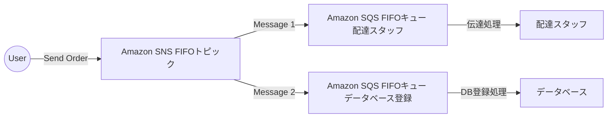
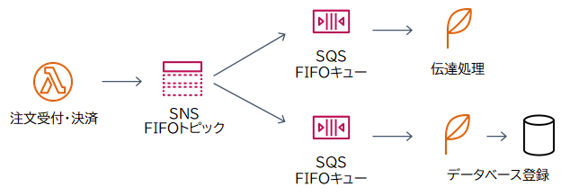

# SNS

2. **Amazon SNSの特徴**
   - フルマネージドのメッセージングサービスで、システム間の通知やデータ連携に使用される。
   - **プッシュ型**の通知サービスで、サブスクライバーの状態に関わらずメッセージを配信可能。

3. **ユースケース**
   - 例えば、**Amazon CloudWatch**でリソース（例: EC2インスタンス）を監視し、その状態に変化があった際に、SNSを使ってメールで通知するケースがある。
   - SNSトピックを作成し、それをCloudWatch Events（Amazon EventBridge）のコンソールから選択して設定することで、リソースの状態変化を購読者に通知できる。

### Amazon SNSの基本概念と設定・処理の流れ

#### 1. **Amazon SNSの基本概念**
   - **Amazon SNS (Simple Notification Service)** は、AWSが提供するフルマネージドのメッセージングサービスです。
   - **Pub/Subモデル**（発行者と購読者モデル）を採用しており、システム間でメッセージを配信します。
     - **Publisher（発行者）**: メッセージを送信する側。
     - **Subscriber（購読者）**: メッセージを受け取る側。

#### 2. **基本の流れ**
   - **トピックの作成**
     - トピックは、メッセージのカテゴリやグループを表します。発行者はこのトピックにメッセージを送信し、購読者はこのトピックからメッセージを受け取ります。
     - 例: 「セール情報」というトピックを作成し、そのトピックにセール情報のメッセージを発行します。

   - **Publisherの設定**
     - 発行者は、特定のトピックにメッセージを送信します。例えば、ECサイトのアプリケーションがセール情報をSNSのトピックに送信する場合、そのアプリケーションが発行者となります。
     - 発行者はトピックにメッセージを「パブリッシュ（publish）」します。

   - **Subscriberの設定**
     - 購読者は、受け取りたいトピックを選択し、メッセージを受信するためのプロトコル（HTTP, HTTPS, Email, SMS, SQSなど）を選びます。
     - 例: ユーザーが「セール情報」トピックを購読し、Eメールで通知を受け取りたいと設定します。

#### 3. **設定手順のまとめ**

1. **トピックを作成する**
   - AWS管理コンソールでSNSにアクセスし、新しいトピックを作成します。
   - トピック名を設定し、用途に応じてパラメータを調整します。

2. **Publisherの設定**
   - 作成したトピックにメッセージを発行するアプリケーションやサービスを設定します。
   - アプリケーション側で、SNSトピックにメッセージを送信するロジックを組み込みます。

3. **Subscriberの設定**
   - 購読者がSNSトピックに対して購読を行います。購読には以下のステップがあります:
     1. **トピックを選択**: 購読したいトピックを選びます。
     2. **プロトコルを選択**: メッセージをどの形式（プロトコル）で受信するかを選びます（例: Eメール, SMS, SQS, Lambda関数など）。
     3. **購読を確認**: 多くの場合、購読者は確認メールを受け取り、購読を確定します。

4. **メッセージの発行と受信**
   - 発行者は、作成したトピックにメッセージを送信します。
   - SNSはトピックにサブスクライブしている購読者全員に、設定されたプロトコルでメッセージを配信します。

#### 4. **Pub/Subモデルのメリット**
   - **非同期処理**: 発行者がメッセージを送信してから、購読者がそれを受信するまでの処理が非同期で行われるため、システムの負荷を分散できます。
   - **拡張性**: 1つのトピックに対して複数の購読者がいる場合でも、SNSが自動的にメッセージを全員に配信します。
   - **柔軟性**: 異なるプロトコルを利用して、さまざまなデバイスやサービスにメッセージを配信できます。

# タイトル: Amazon SNSとSQSの違いと活用方法の徹底解説

## はじめに

AWSのメッセージングサービスである**Amazon SNS**（Simple Notification Service）と**Amazon SQS**（Simple Queue Service）は、システム間でメッセージを効率的に連携するための重要なサービスです。しかし、それぞれのサービスがどのように機能し、どのようなシナリオで使用するのが適切かを理解することは、適切なシステム設計において非常に重要です。本記事では、SNSとSQSの違いやそれぞれの特徴、適切な使い方について図解を交えながら解説します。

## Amazon SNSとSQSの基本的な違い

### 1. Amazon SNS（Simple Notification Service）

**Amazon SNS**は、**プッシュ型のメッセージングサービス**です。SNSはトピックを介してメッセージを送信し、複数のサブスクライバー（購読者）に同時に通知を送ります。SNSには**標準トピック**と**FIFOトピック**の2種類があります。

- **標準トピック**: メッセージの順序や重複排除を保証しないが、高スループットで大量のメッセージを扱うことができます。
- **FIFOトピック**: メッセージの順序と重複排除を保証します。メッセージが送信された順番に配信され、1回だけ配信されることが保証されます。

**主な特徴**:
- **プッシュ型**: メッセージが自動的にサブスクライバーに送信されます。
- **複数の購読者**: 同時に複数のエンドポイント（Lambda関数、SQSキュー、HTTPエンドポイントなど）にメッセージを配信できます。

### 2. Amazon SQS（Simple Queue Service）

**Amazon SQS**は、**プル型のメッセージングサービス**です。メッセージをキューに格納し、受信側が必要なときにメッセージを取得する仕組みです。SQSには**標準キュー**と**FIFOキュー**の2種類があります。

- **標準キュー**: メッセージの順序を保証せず、重複する場合がありますが、非常に高いスループットでメッセージを処理できます。
- **FIFOキュー**: メッセージの順序と重複排除を保証し、順序通りに処理することが求められるシナリオに適しています。

**主な特徴**:
- **プル型**: 受信側がメッセージを取得するタイミングを制御できます。
- **1つの受信者**: キューからメッセージを取得した後、そのメッセージはキューから削除されます。

## SNSとSQSの関係

以下に、SNSとSQSの関係を図解し、理解を深めていきます。

### 図解の説明

1. **ユーザーからの注文**: ユーザーが注文を送信すると、その注文情報はSNS FIFOトピックに送られます。
   
2. **SNS FIFOトピック**: このトピックは、メッセージの順序と重複排除を保証し、配達スタッフ用のSQS FIFOキューと、データベース登録用のSQS FIFOキューにメッセージを同時に配信します。

3. **SQS FIFOキュー**: それぞれのキューに配信されたメッセージは、順番に処理されます。配達スタッフ用のキューは配達スタッフに指示を送り、データベース登録用のキューはデータベースに注文情報を保存します。

### 理解を深めるためのポイント

- **順序の保証**: SNS FIFOトピックとSQS FIFOキューを組み合わせることで、メッセージが送信された順番通りに処理されることが保証されます。
- **重複排除**: 同じメッセージが複数回処理されることを避けるために、FIFOトピックとキューを使用します。
- **プッシュとプル**: SNSはプッシュ型でメッセージを複数のサブスクライバーに同時に送信し、SQSはプル型で受信側が任意のタイミングでメッセージを処理します。

## 結論

Amazon SNSとSQSは、システム間で効率的にメッセージをやり取りするための強力なツールです。それぞれの特徴を理解し、適切に組み合わせることで、順序保証や重複排除を必要とする複雑なシステムでも、確実かつ効率的なメッセージングが実現できます。今回のようなシステム設計においては、SNS FIFOトピックとSQS FIFOキューを組み合わせることで、順序通りの処理と重複排除を保証するソリューションが提供できます。
