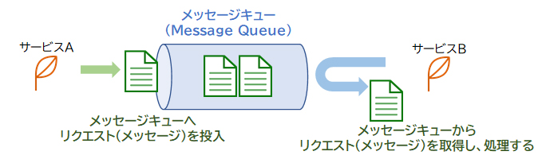
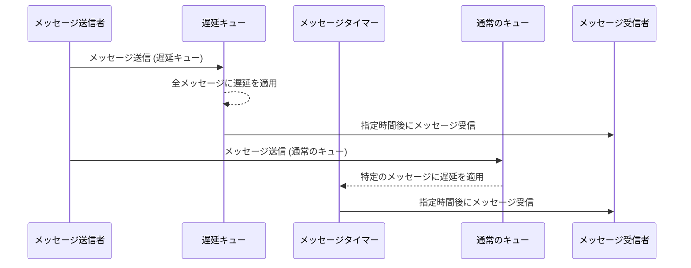
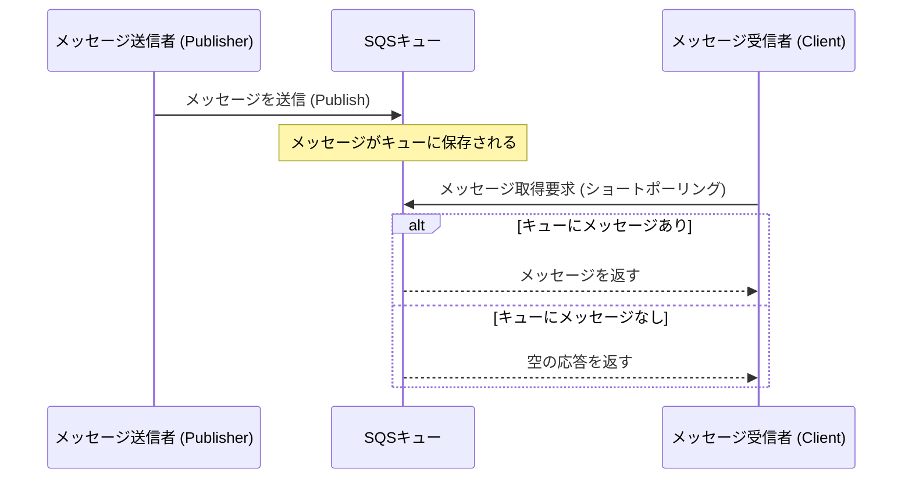
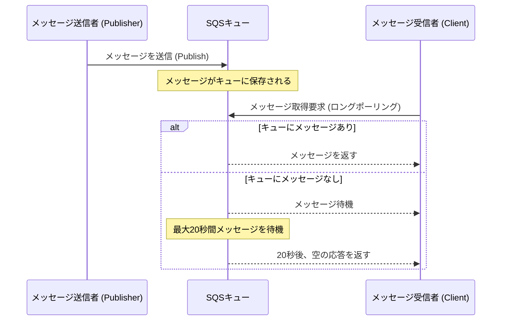

# SQS

### 要点まとめ

1. **Amazon SQSの概要**
   - フルマネージドのメッセージキューイングサービス。
   - メッセージを介してサービス間の連携を実現。
   - プル型で、受信側が任意のタイミングでメッセージを取得。

2. **SQSのキューの種類**
   - **標準キュー**
     - メッセージの処理順序は保証されない。
     - 同じメッセージが複数回配信される可能性がある。
     - 受信側で順序や重複の処理を制御する必要がある。
   - **FIFOキュー**
     - メッセージが送信された順序で処理される（先入れ先出し）。
     - メッセージの重複取得はない。
     
# Use case database
### 要点まとめ（データベースを絡めた処理のユースケース含む）

1. **Amazon SQSの役割**
   - Amazon SQSはフルマネージドのメッセージキューイングサービスで、サービス間の非同期通信を可能にし、システムの疎結合を実現する。

2. **ユースケースの概要**
   - 典型的なユースケースでは、**アプリケーション**がデータベースに対するリクエストをSQSに送信し、**データベース**がSQSにポーリングを行い、メッセージを取得して処理する。
   - このパターンは、システムが高負荷状態であっても、アプリケーションがリクエストを安全に送信し続けることができるため、データの整合性と可用性を保つのに有効です。

3. **データベースを絡めた処理のユースケース**
   - **バッチ処理システム**:
     - 例えば、ECサイトで大量の注文が発生する場合、注文データをアプリケーションからデータベースに直接書き込むのではなく、一旦SQSにメッセージとして送信します。データベースは適切なタイミングでこれらのメッセージを取得し、バッチ処理で注文データを効率的に登録します。
   - **イベント駆動型アーキテクチャ**:
     - ユーザーアクション（例: ユーザーがフォームを送信）により発生するイベントをSQSに送信し、そのイベントに基づいてデータベースの更新が行われる。これにより、リアルタイム処理が必要なシステムでも、処理の順序や整合性を保ちやすくなる。

4. **正しいシステムの動作**
   - **アプリケーション**はデータベースへのリクエストをSQSに送信する。
   - **データベース**はSQSにあるリクエストを適時取得し、順次処理を行う。

5. **他の選択肢が誤りである理由**
   - **SQSが定期的にリクエストを送信する**: SQS自体が能動的にアクションを起こすことはない。
   - **SQSがリクエストの量を把握・分析する**: SQSはリクエスト量の把握や分析は行わない。
   - **SQSがデータベースの負荷状況を監視する**: SQSは負荷状況の監視を行わない。

6. **疎結合のメリット**
   - サービスが互いの負荷や障害の影響を受けずに処理を進められる。
   - システム全体の柔軟性や独立性が向上する。

### スタンダードなユースケースとその適用例

- **バッチ処理システム**や**イベント駆動型アーキテクチャ**など、負荷の高いシステムやリアルタイム性が求められるシステムで、Amazon SQSを使用することでシステム全体の安定性とパフォーマンスを向上させることができます。

Amazon SQSの遅延キューとメッセージタイマーの違いを示すためのMermaidJSのシーケンス図を作成しました。

### 説明

1. **遅延キュー (DelayQueue)**
   - メッセージ送信者が遅延キューにメッセージを送信します。
   - 遅延キューは、すべてのメッセージに対して一律の遅延を設定します。
   - 設定された時間後に、メッセージが受信者に配信されます。

2. **メッセージタイマー (MessageTimer)**
   - メッセージ送信者が通常のキューにメッセージを送信します。
   - 送信されたメッセージに対して、特定のメッセージタイマーが適用されます。
   - 設定された時間後に、そのメッセージのみが受信者に配信されます。

### 差異のポイント

- **遅延キュー**: キュー全体に対して遅延が適用される。すべてのメッセージが同じ遅延時間後に受信可能。
- **メッセージタイマー**: 個別のメッセージに遅延を設定できる。特定のメッセージのみが指定時間後に受信可能。

# Amazon SQSのロングポーリングとショートポーリングの違いを、MermaidJSを使ったシーケンス図とともに解説します。

### 1. **ショートポーリング**

ショートポーリングは、メッセージがキューにある場合はすぐに返され、ない場合でも即座に「空の応答」を返します。

### ショートポーリングのポイント
- **即座に応答**: キューにメッセージがない場合でも、すぐに「空の応答」が返されるため、クライアントはメッセージが存在しないことを即時に知ることができます。
- **APIコールが増える**: メッセージがないときも頻繁にリクエストを送るため、APIコール数が多くなり、コストがかかる場合があります。

---

### 2. **ロングポーリング**

ロングポーリングは、メッセージがキューにない場合、一定時間（最大20秒）待機してから応答を返します。

### ロングポーリングのポイント
- **待機時間**: キューにメッセージがない場合、SQSは指定された待機時間（最大20秒）を使ってメッセージを待機します。その間にメッセージが到着すれば、それを返します。
- **APIコール数の削減**: 待機時間があるため、空の応答を返す頻度が減り、APIコール数を抑えることができます。これによりコストの削減が期待できます。

---

### 図解の比較

| ポーリングの種類 | メッセージがある場合 | メッセージがない場合 |
|------------------|----------------------|----------------------|
| **ショートポーリング** | メッセージを即時返す | 空の応答を即時返す |
| **ロングポーリング**  | メッセージを即時返す | 指定時間待機後に空の応答を返す |

### まとめ

- **ショートポーリング**は即座に応答が返されますが、空の応答が多くなるとAPIコール数が増え、コストがかさむ可能性があります。
- **ロングポーリング**は待機時間があるため、APIコール数を抑えることができ、特にメッセージが頻繁に送られてこない場合に効果的です。

この図解と解説を参考にすると、ショートポーリングとロングポーリングの動作の違いが視覚的に理解できると思います。

以下のような表で、APIの種類を評価形式でまとめました。

| API 名                      | 評価 | 説明                                                                                         | サービス       |
|-----------------------------|------|----------------------------------------------------------------------------------------------|----------------|
| **ChangeMessageVisibility** | 高   | 特定のメッセージの可視性タイムアウトを変更し、他のコンシューマーが見えなくする。                | Amazon SQS     |
| **AddPermission**           | 中   | 特定のエンティティに対してキューへのアクセス権限を付与。                                      | Amazon SQS     |
| **CreateQueue**             | 中   | 新しいキューを作成する。                                                                     | Amazon SQS     |
| **ReceiveMessage**          | 高   | キューからメッセージを取得するためのAPI。ポーリングが可能。                                  | Amazon SQS     |

この表は、APIの評価、説明、およびどのサービスに属しているかを一目で確認できるようにまとめたものです。

## AWS SQSのメッセージ重複問題と可視性タイムアウトの重要性

### 背景

AWS上でウェブアプリケーションを構築する場合、Amazon SQS（Simple Queue Service）はメッセージキューイングの役割を果たし、複数のシステムコンポーネント間でメッセージを効率的にやり取りすることができます。しかし、メッセージキューを使用する際に、メッセージの重複処理が問題になることがあります。

### 問題点の概要

特定のシナリオでは、Amazon SQSキュー内のメッセージには重複が存在しないにもかかわらず、Amazon RDSデータベースに重複レコードが保存されてしまうことがあります。これは、EC2インスタンス（コンシューマー）がキューからメッセージを2度取得してしまう可能性が原因です。

### 解決策：可視性タイムアウトの設定

この問題を解決するために、**可視性タイムアウト**という仕組みを利用します。可視性タイムアウトとは、コンシューマーがメッセージを受信した後、指定された時間内はそのメッセージが他のコンシューマーから見えなくなる設定です。これにより、同じメッセージが二重に処理されることを防ぐことができます。

#### 可視性タイムアウトの動作メカニズム

1. **メッセージ受信後の非可視化**: メッセージがコンシューマー（例: EC2インスタンス）によってポーリングされると、SQSはそのメッセージを指定した可視性タイムアウト期間だけ非可視化します。この間、他のコンシューマーからはそのメッセージが見えません。
   
2. **メッセージの削除または再可視化**: コンシューマーがメッセージを正常に処理して削除すると、そのメッセージはキューから完全に削除されます。しかし、もしコンシューマーがメッセージを削除せずに処理を終了すると、可視性タイムアウトが切れた後に、再度他のコンシューマーからそのメッセージが見えるようになります。

3. **再処理の防止**: この仕組みにより、重複処理を防ぐことができ、Amazon RDSなどのデータストアに重複レコードが作成されるリスクを軽減します。

### 他のAPIの役割

- **ReceiveMessage API**: メッセージをキューから取得するためのAPIですが、適切な待機時間（ロングポーリング）を設定することで、不要なAPIリクエストを減らすことができます。ただし、メッセージの重複処理を防ぐ機能ではありません。

- **AddPermission API**: SQSキューにアクセスできるエンティティに対する権限を管理するためのAPIです。これはセキュリティ設定に関連しますが、メッセージの重複処理には直接関与しません。

- **CreateQueue API**: 新しいSQSキューを作成するためのAPIです。新しいキューを作成しても、既存のメッセージ処理の問題を解決するものではありません。

### まとめ

Amazon SQSを利用したシステムでメッセージの重複処理が発生するリスクを軽減するためには、**可視性タイムアウトの適切な設定**が不可欠です。ChangeMessageVisibility APIを使って可視性タイムアウトを設定し、メッセージが一度に一つのコンシューマーによってのみ処理されるようにしましょう。この設定は、データベースの一貫性を保ち、システム全体の信頼性を向上させるために非常に重要です。