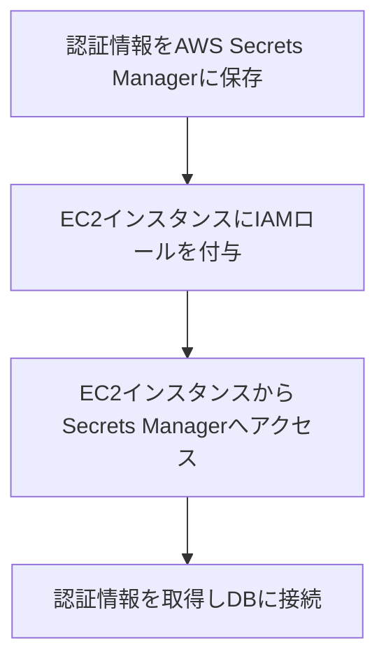
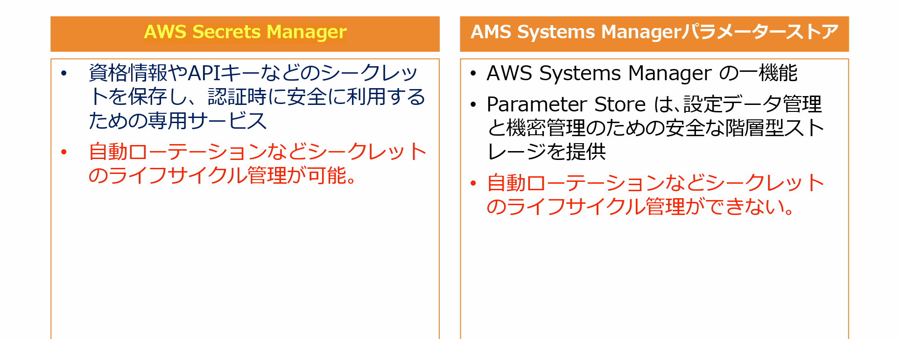

# AWS Secrets ManagerでセキュアなDB認証を実現する方法

## はじめに

AWS上でアプリケーションを運用する際、データベース認証情報の管理は非常に重要です。特にセキュリティを強化するために、認証情報を安全に保存し、自動的にローテーションすることが求められます。本記事では、AWS Secrets Managerを使用してデータベースの認証情報をセキュアに管理する方法を解説します。

## 要件の概要

1. **データベース認証情報を安全に保存する**
2. **認証情報を自動的にローテーションする**
3. **EC2インスタンスから安全にデータベースに接続する**

## 正しいソリューション: AWS Secrets Managerの活用

### 1. AWS Secrets Managerとは

**AWS Secrets Manager**は、データベースやその他のサービスの認証情報、APIキー、その他の機密データ（シークレット）を安全に保存し、管理するためのサービスです。Secrets Managerを使用することで、認証情報の暗号化、取得、そして自動ローテーションを行うことができます。

### 2. セキュアなDB認証の構成方法

#### ステップ1: 認証情報をAWS Secrets Managerに保存
AWS Secrets Managerにデータベースのユーザー名とパスワードを保存します。これにより、認証情報は安全に暗号化され、アクセス制御が可能になります。

#### ステップ2: EC2インスタンスにIAMロールを付与
次に、EC2インスタンスがSecrets Managerから認証情報を取得できるように、IAMロールを作成し、Secrets Managerへのアクセス権限を付与します。このロールをEC2インスタンスにアタッチします。

#### ステップ3: EC2インスタンスからSecrets Managerへアクセス
アプリケーションが実行されているEC2インスタンス上で、AWS SDKを使用してSecrets Managerにアクセスし、認証情報を取得します。取得した認証情報を使用して、データベースに安全に接続します。

### 図解: AWS Secrets Managerを利用したセキュアなDB接続

### 3. 自動ローテーションの設定

AWS Secrets Managerは、保存された認証情報を自動的にローテーションする機能を提供しています。これにより、認証情報が定期的に変更されるため、セキュリティリスクを低減できます。ローテーションの設定は、AWSコンソールまたはCLIを使用して簡単に行うことができます。

## 他のオプションとの比較

### AWS Systems Manager Parameter Store
**AWS Systems Manager Parameter Store**も機密情報の保存に使用できますが、Secrets Managerと比較して以下の制約があります：
- **自動ローテーションがない**: Parameter Storeには自動ローテーション機能がないため、手動で管理する必要があります。
- **主な用途の違い**: Parameter Storeは、パラメータの管理やシステム設定の保存に適していますが、シークレットの管理にはSecrets Managerが推奨されます。

### AWS Secrets Managerの利点
- **自動ローテーション**: 認証情報を自動的にローテーションし、セキュリティを向上させます。
- **強力なアクセス制御**: IAMポリシーを使用して、特定のリソースのみがシークレットにアクセスできるように設定できます。
- **簡単な統合**: AWSの他のサービスとシームレスに統合され、データベースやAPIの認証情報を簡単に管理できます。

## まとめ

AWS Secrets Managerを利用することで、データベースの認証情報を安全に保存し、定期的に自動ローテーションすることができます。これにより、セキュリティリスクを低減し、アプリケーションの信頼性を向上させることができます。AWS SAA試験では、Secrets Managerの機能とその適切な使用方法を理解しておくことが重要です。