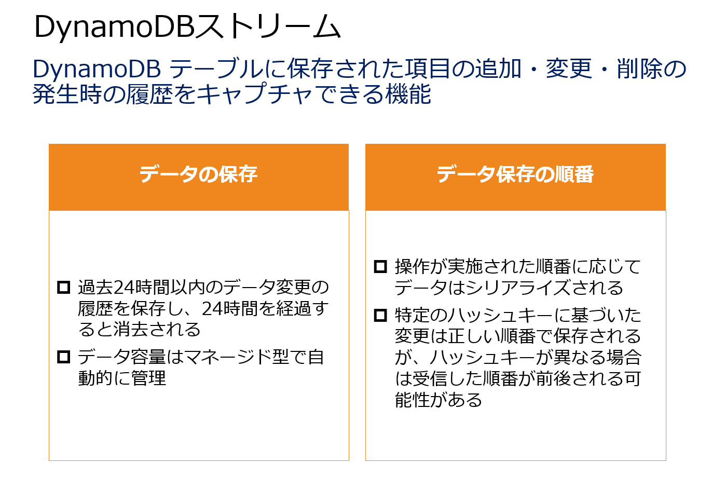
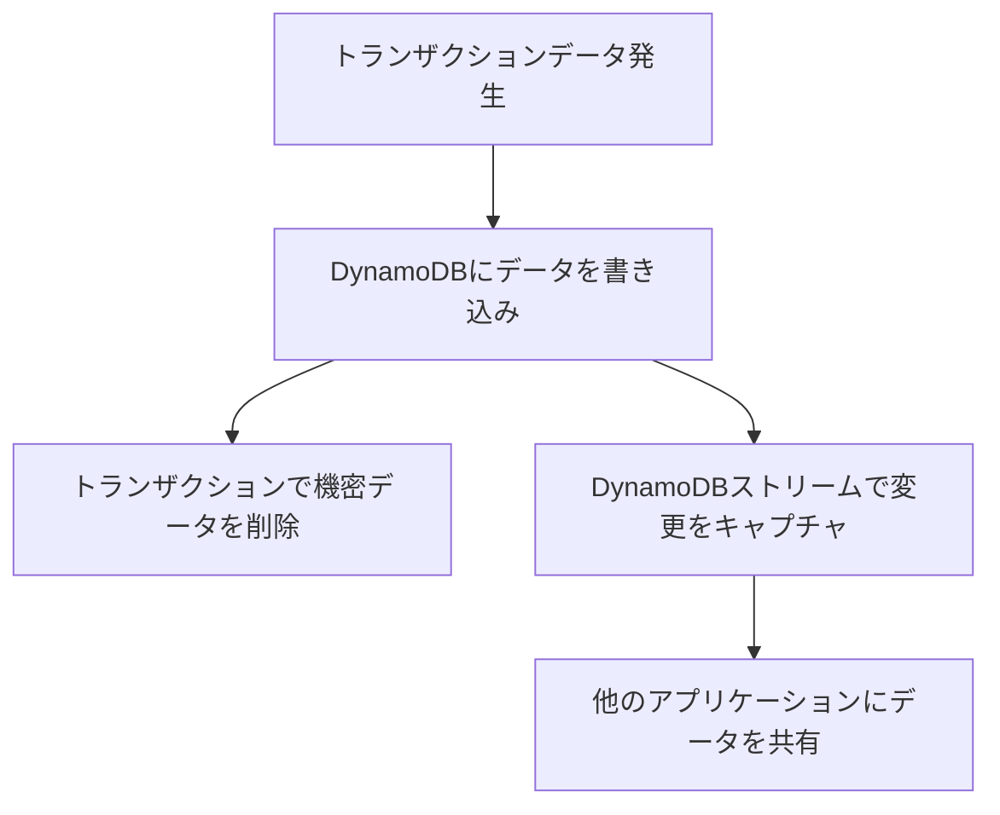
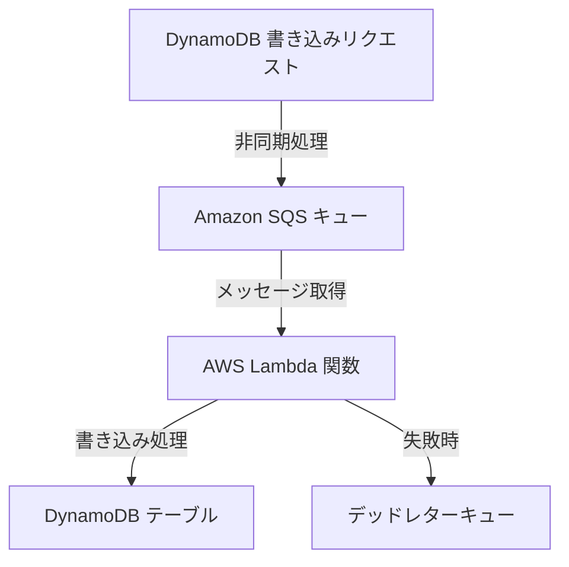

# DynamoDB

# DynamoDBのキャパシティモードの選択: オンデマンドモードとプロビジョンドスループットモード

## DynamoDBのキャパシティモードとは？

Amazon DynamoDBは、NoSQLデータベースサービスであり、アプリケーションのスケーラビリティとパフォーマンスを最適化するために、**オンデマンドモード**と**プロビジョンドスループットモード**という2つのキャパシティモードを提供しています。それぞれのモードには、特定のワークロードや使用ケースに適した特長があります。

## キャパシティモードの概要

### 1. オンデマンドモード
- **特徴**: DynamoDBが自動的にスケーリングし、読み書きのキャパシティを自動調整します。キャパシティ設定の手間が不要で、使った分だけ課金されるため、予測が難しいワークロードに適しています。
- **適用シナリオ**: トラフィックが予測できない、または突発的なスパイクが発生するワークロードに最適です。例えば、特定の時間帯にアクセスが集中するアプリケーションなど。
  
  

### 2. プロビジョンドスループットモード
- **特徴**: 読み取りと書き込みのキャパシティを事前に設定し、そのキャパシティに基づいて運用します。オートスケーリングを設定することで、キャパシティを自動調整することも可能です。あらかじめトラフィックが予測できる場合に適しています。
- **適用シナリオ**: トラフィックパターンが安定しており、予測可能な場合に使用されます。リソースの利用が一定で、効率的なコスト管理を行いたい場合に最適です。
  
  

## 問題の解説と正しい選択

### シナリオの概要
ある企業は、DynamoDBを使用してアプリケーションのデータレイヤーを構築しています。午前中はデータ処理がほとんど発生しないものの、午後以降に利用が増え、夕方には予測不能なトラフィックスパイクが発生する可能性があります。このような不安定なトラフィックに対して、最適なコストパフォーマンスを提供するソリューションを選択する必要があります。

### 適切な選択肢: オンデマンドモード
このシナリオでは、トラフィックが予測できないため、**オンデマンドモードのDynamoDBテーブルを作成**するのが最適です。オンデマンドモードでは、トラフィックの急増に対応できるように自動的にスケーリングし、リソースの無駄遣いを防ぎつつ、必要なキャパシティを確保します。

### 誤解しやすい選択肢の解説
- **グローバルテーブルの設定**: グローバルテーブルは、データのレプリケーションや複数リージョンでのデータアクセス速度の向上に利用されますが、今回のシナリオでは直接関係しません。
- **プロビジョンドスループットモード**: このモードはトラフィックが予測可能な場合に適しており、安定した負荷を持つワークロードに使用します。予測不能なトラフィックには対応が難しいため、このシナリオには不向きです。

## まとめ

DynamoDBのキャパシティモードは、アプリケーションの特性に応じて選択する必要があります。**オンデマンドモード**は、トラフィックが予測できない場合や急激な変動がある場合に最適であり、**プロビジョンドスループットモード**は、安定したトラフィックが予測される場合に適しています。AWS SAA試験では、各モードの特性と適切な適用シナリオを理解することが重要です。

これを理解することで、適切なDynamoDBの運用ができ、コスト効率の高いアーキテクチャを構築するための知識を身につけることができます。

# DynamoDBトランザクションとストリームを活用したスケーラブルなトランザクション処理

## はじめに

AWS上でEコマースアプリケーションを運用する場合、大量のトランザクションデータをスケーラブルかつリアルタイムに処理し、他の経理関連アプリケーションと共有することが重要です。本記事では、Amazon DynamoDBのトランザクション機能とDynamoDBストリームを利用して、これらの要件を満たす方法について解説します。

## 要件の概要

1. **スケーラブルでほぼリアルタイムにトランザクションデータを共有する**
2. **データ保存前に機密性の高いデータを削除する前処理を行う**
3. **他のアプリケーションとトランザクションデータを共有する**

## 正しいソリューション: Amazon DynamoDBとDynamoDBストリームの活用

### 1. Amazon DynamoDBトランザクションの利用

Amazon DynamoDBは、NoSQLデータベースサービスであり、スケーラブルで高可用性を提供します。特にDynamoDBのトランザクション機能を使用すると、以下の操作が可能です。

- **Put**: 新しい項目を作成するか、既存の項目を置き換えます。
- **Update**: 既存の項目の属性を編集、追加、削除します。
- **Delete**: 特定の項目を削除します。
- **ConditionCheck**: 項目の特定の条件を確認します。

これらのトランザクション操作を利用して、DynamoDBにデータを書き込む際に機密性の高いデータを削除する前処理を行うことができます。

### 2. DynamoDBストリームによるリアルタイムデータ共有

DynamoDBストリームは、DynamoDBテーブルの項目が変更された際に、その変更をキャプチャし、他のシステムにリアルタイムで連携する機能です。これにより、テーブルに保存されたトランザクションデータを他の経理関連アプリケーションにリアルタイムで共有することができます。

### 図解: DynamoDBを中心としたトランザクション処理の流れ

## なぜ他の選択肢は不適切なのか？

### 1. Amazon Kinesis Data Firehose
- **理由**: Kinesis Data Firehoseは、DynamoDBに直接データを配信できません。主にAmazon S3やAmazon Redshiftなどのサービスにデータを送信するためのサービスであり、今回の要件には合致しません。

### 2. Amazon Kinesis Data Streams
- **理由**: Kinesis Data StreamsもDynamoDBにデータを直接保存することはできません。また、複数のストレージに保存する構成はコスト効率が悪いです。

### 3. Amazon EMR
- **理由**: Amazon EMRはビッグデータの処理や分析に適しており、データのクレンジングには使えますが、DynamoDBとの連携や機密データの削除に適した選択肢ではありません。

## まとめ

DynamoDBのトランザクション機能を利用することで、機密データの削除と同時にトランザクションデータを保存することができます。さらに、DynamoDBストリームを活用することで、リアルタイムにデータを他のシステムと共有することが可能です。この構成は、スケーラブルでリアルタイムなデータ処理が求められるシナリオに最適です。AWS SAA試験では、これらの機能を理解し、適切に利用するための知識を身につけておくことが重要です。

## タイトル: **AWS DynamoDB 書き込み処理の最適化と冗長性確保**

### DynamoDBの書き込み処理の課題

企業がDynamoDBを利用する際、特に書き込み処理が増加する状況では、データベースの処理遅延や失敗が発生することがあります。このような状況で、データが失われないようにするには、書き込みリクエストを適切に処理するための仕組みが必要です。

### DynamoDB書き込み処理の最適化手法

#### 1. Amazon SQSとLambdaの連携

- **Amazon SQS** (Simple Queue Service): メッセージを非同期で処理するための完全マネージド型メッセージキューイングサービス。メッセージをキューに格納し、処理が可能な時点で取り出して処理を行います。
- **AWS Lambda**: サーバーレスでコードを実行できるサービス。Lambda関数がSQSキューからメッセージを取得し、その内容に基づいてDynamoDBに書き込み処理を実行します。

#### 2. デッドレターキューの設定

- **デッドレターキュー**: Lambda関数の処理が失敗した場合、処理に失敗したメッセージを保存しておくためのキュー。これにより、データが完全に失われることを防ぎ、後続の処理が確実に行われるようにします。

### 不適切な選択肢とその理由

#### 1. DynamoDBにIOPSボリュームを利用する構成
- DynamoDBはIOPSの設定ができません。また、この構成では書き込みリクエストの損失を防ぐことができません。

#### 2. Amazon SQSキューのみを利用する構成
- SQSキューはメッセージの配信を管理しますが、DynamoDBへの書き込み処理そのものは行いません。Lambda関数と組み合わせることで、初めてDynamoDBへの書き込み処理が実現します。

#### 3. EC2インスタンスを利用した処理
- EC2インスタンスを使用してDynamoDBの処理を行うことは可能ですが、Lambda関数を用いる方がコスト効率が高く、デッドレターキューの設定も容易です。

### 結論

DynamoDBにおける書き込み処理の信頼性を高めるためには、Amazon SQSキューを利用し、AWS Lambda関数と連携させることが最適です。さらに、デッドレターキューを設定することで、処理が失敗した場合でもメッセージを保存し、再処理が可能となる仕組みを構築することができます。

このように、DynamoDBの書き込み処理に対してSQSとLambdaを組み合わせた非同期処理を設定し、デッドレターキューを用いることで、どのような状況でもデータが失われないようにすることが可能です。