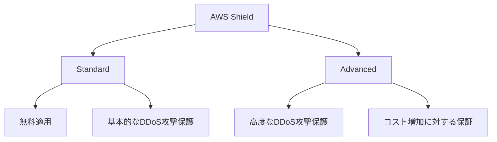

# Sheild

# AWSにおけるDDoS攻撃対策とコスト管理: AWS Shield StandardとAdvancedの違い

## はじめに

AWS上にウェブアプリケーションをホストする場合、DDoS（Distributed Denial of Service）攻撃に対する対策は非常に重要です。特に、DDoS攻撃によるリクエスト増加は、サーバーの負荷を増大させるだけでなく、コストの急増を引き起こす可能性があります。本記事では、AWSが提供するDDoS攻撃対策サービスである**AWS Shield Standard**と**AWS Shield Advanced**の違いを解説し、どのようにコスト管理が行われるかを説明します。

## DDoS攻撃とは？

DDoS攻撃は、膨大な量のリクエストをサーバーに送りつけることで、サーバーのリソースを枯渇させ、サービスを停止させるサイバー攻撃です。AWSでは、DDoS攻撃による影響を軽減するために、いくつかのサービスを提供していますが、それぞれのサービスがどのように機能し、どのようにコスト管理を行うかが重要なポイントです。

## AWS Shieldの概要

AWS Shieldには**Standard版**と**Advanced版**の2種類があります。それぞれの機能と違いを以下にまとめます。

### AWS Shield Standard

- **基本機能**: AWS Shield Standardは、AWSのCloudFrontやRoute 53などのサービスに対して、自動的に無料で適用されます。このバージョンは、一般的なDDoS攻撃に対する基本的な保護を提供します。
- **対応範囲**: 主にネットワーク層やトランスポート層に対するDDoS攻撃を自動で軽減します。
- **コスト管理**: Shield Standardは無料で提供されますが、DDoS攻撃によるコスト増加に対する保証はありません。

### AWS Shield Advanced

- **追加機能**: AWS Shield Advancedは、Shield Standardの機能に加え、より高度なDDoS攻撃の検出と緩和機能を提供します。さらに、DDoS攻撃によるリクエストの急増によって発生するコストの急増に対しても保証が提供されます。
- **コスト管理**: Shield Advancedは有料サービスですが、DDoS攻撃によって発生した可能性のあるAWS請求額の急増に対してコスト面の保証を提供します。この機能により、DDoS攻撃の影響を最小限に抑えつつ、予期しないコスト増を防ぐことができます。

### 図解: AWS Shield StandardとAdvancedの比較

## シナリオの解説

### 誤解されがちなポイント
多くのユーザーが**AWS Shield Standard**が提供する無料の基本保護に満足しがちですが、DDoS攻撃によるリクエストの急増が発生した場合、そのコスト増加を保証することはできません。

### 正しい選択肢
このシナリオでは、**AWS Shield Advanced**を適用することで、DDoS攻撃によって発生する可能性のあるリクエスト増加に伴うコスト急増を保証することが最適です。AWS Shield Advancedを有効にすることで、より高度な保護機能を利用でき、さらに予期しないコスト増加を回避することが可能になります。

## まとめ

AWS環境でのDDoS攻撃対策において、**AWS Shield Advanced**は、基本的なDDoS保護機能に加え、コスト急増に対する保証を提供するため、重要な選択肢となります。特に、DDoS攻撃によるリクエスト増加が懸念される場合には、Shield Advancedを導入することで、コストリスクを管理しつつ、アプリケーションの可用性を確保することができます。AWS SAA試験では、これらのサービスの違いと適用シナリオを理解しておくことが重要です。