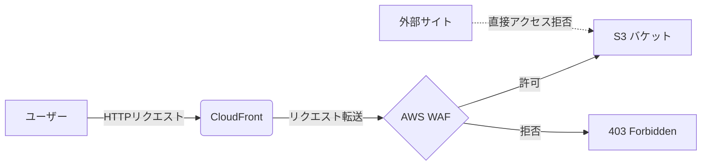

# タイトル: AWS WAFを活用したDDoS攻撃の防御方法

## はじめに

DDoS（Distributed Denial of Service）攻撃は、膨大なリクエストを特定のWebサービスに送りつけることでサービスを妨害するサイバー攻撃です。この攻撃を防ぐためには、適切なセキュリティ対策が必要です。この記事では、AWSが提供するセキュリティサービスを中心に、特にAWS WAFを使用したDDoS攻撃防御の手法について解説します。また、誤った選択肢の理解を深めるために、関連するサービスについても説明します。

## AWS WAFとは

**AWS WAF**（Web Application Firewall）は、Webアプリケーションをさまざまな攻撃から保護するためのセキュリティサービスです。WAFは、特定のIPアドレス、HTTPヘッダー、HTTP本文、URI文字列などに基づいてトラフィックをフィルタリングし、ルールを設定することで、脆弱性を突いた攻撃（例：クロスサイトスクリプティングやSQLインジェクション）からWebアプリケーションを守ります。

### AWS WAFの主な機能

- **Web ACL（アクセスコントロールリスト）**: WAFの中心となる機能で、トラフィックを許可するかブロックするかを決定するルールのセットを定義します。
- **地理的一致ルール**: 特定の国や地域からのアクセスを制限する機能。
- **レートベースのルール**: 特定の時間内にリクエスト数が設定値を超えたIPアドレスを自動的にブロックする機能。

## 適切なDDoS攻撃対策

### レートベースのルールの適用

頻繁にIPアドレスを変更する不審なアクセスを伴うDDoS攻撃に対しては、**レートベースのルール**を適用するのが最も効果的です。レートベースのルールでは、特定の時間枠（例：5分間）に一定のリクエスト数を超えた場合、そのIPアドレスを自動的にブロックします。これにより、DDoS攻撃の影響を受けにくくすることができます。

## 誤解されがちなAWSサービス

### Amazon Inspector

**Amazon Inspector**は、EC2インスタンスの脆弱性を検出するセキュリティサービスです。Inspectorは、ネットワークトラフィックを監視し、潜在的なセキュリティリスクを報告しますが、リアルタイムでDDoS攻撃を防ぐための機能はありません。そのため、DDoS攻撃の防御策としては不適切です。

### AWS WAFの地理的一致ルール

**地理的一致ルール**を使用すると、特定の国や地域からのアクセスを制限できますが、頻繁にIPアドレスが変更される攻撃に対しては効果が限定的です。DDoS攻撃の特性を考慮すると、レートベースのルールの方が効果的です。

### ネットワークACL

**ネットワークACL**は、VPC内のサブネットレベルでトラフィックを制御します。特定のIPアドレスやIPアドレス範囲をブロックするために使用されますが、攻撃者がIPアドレスを頻繁に変更する場合、ネットワークACLだけでは効果的な防御が難しくなります。

## 結論

DDoS攻撃に対する防御策として、AWS WAFの**レートベースのルール**を設定することが最も効果的です。その他のサービス（Amazon InspectorやネットワークACLなど）は、特定のセキュリティ目的に役立ちますが、DDoS攻撃を直接防御するためには不適切です。AWS WAFを活用することで、Webサービスの安全性を高め、攻撃によるサービス停止のリスクを軽減できます。
# AWS WAFを用いたS3コンテンツの安全な配信方法

## 概要
Amazon S3、CloudFront、AWS WAFを組み合わせることで、S3バケット内のコンテンツを安全かつ効率的に配信できます。特に、AWS WAFのReferer制限機能を利用することで、不正な外部リンクからのアクセスを防ぐことができます。

## 主要コンポーネント

1. **Amazon S3**: コンテンツの保存
2. **Amazon CloudFront**: コンテンツの高速配信
3. **AWS WAF**: アクセス制御とセキュリティ

## AWS WAFの主な機能

| 機能 | 説明 |
|------|------|
| リクエストモニタリング | CloudFrontに転送されるHTTP/HTTPSリクエストを監視 |
| アクセスコントロール | 指定条件に基づきアクセスを許可/拒否 |
| Referer制限 | HTTPリクエストのRefererヘッダーに基づきアクセスを制限 |

## Referer制限の仕組み

1. ユーザーがリンクをクリックすると、ブラウザはRefererヘッダーにリンク元のURLを含めてリクエストを送信
2. AWS WAFがRefererヘッダーを確認
3. 許可されたRefererからのリクエストのみS3コンテンツにアクセス可能
4. 不正なRefererからのリクエストは403 Forbiddenエラーを返す

## 他のセキュリティオプションとの比較

1. **署名付きURL/Cookie**:
   - 一時的なアクセス権を提供
   - URLの共有自体は防げない
   - 有効期限後はアクセス不可

2. **S3アクセス暗号化**:
   - 通信の安全性を向上
   - URLリンクの制限には直接関係なし

## AWS WAF Referer制限の利点

1. 永続的な外部リンク制限が可能
2. CloudFrontと連携し、効率的なコンテンツ配信を維持
3. 柔軟なルール設定が可能（IP制限など他の制限と組み合わせ可能）

## 実装のポイント

1. S3バケットにCloudFrontディストリビューションを設定
2. AWS WAFをCloudFrontに関連付け
3. WAFでReferer制限のルールを設定
4. 必要に応じて他のセキュリティルールを追加

この方法を使用することで、S3に保存されたコンテンツを安全に配信しつつ、不正な外部リンクからのアクセスを効果的に防ぐことができます。AWS WAFの適切な設定は、コンテンツ配信におけるセキュリティと柔軟性を両立させる重要な要素です。