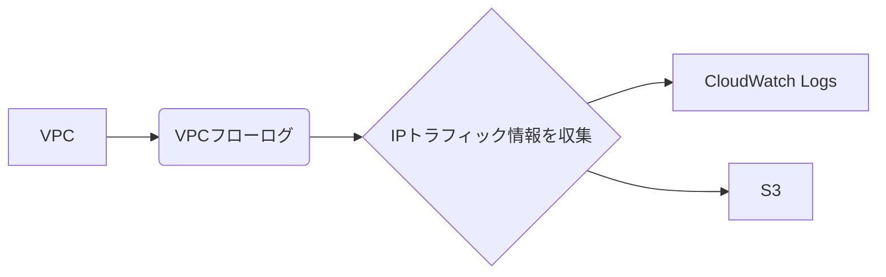
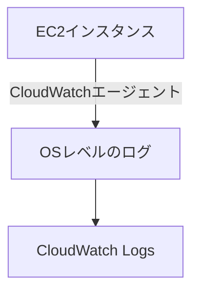

# CloudWatch

以下に要点を簡潔にまとめます。

### 要点まとめ

2. **CloudWatch Logsのサブスクリプションフィルター**
   - CloudWatch Logsのサブスクリプションフィルターを設定することで、ログデータをリアルタイムに別のサービス（例: OpenSearch Service）へストリーミングできます。
   - サブスクリプションフィルターを使用することで、フィルタリングされたデータのみを対象のサービスに送信することも可能です。
# 中央ロギングのためのAWSサービスの理解

## タイトル：AWSによるEC2インスタンスの中央ロギング管理

AWSのソリューションアーキテクトとして、EC2インスタンスのログ管理はシステムの運用効率を高めるために非常に重要です。本記事では、EC2インスタンスのログを中央管理するために利用できる主要なAWSサービスについて、理解を深めるための要点を解説します。

### 1. **VPCフローログ**

**VPCフローログ**は、VPC内のネットワークインターフェースに出入りするIPトラフィック情報をキャプチャする機能です。これにより、EC2インスタンスのネットワークトラフィックを監視し、セキュリティや運用の観点から分析することが可能です。これらのログはAmazon CloudWatch LogsやS3に送信し、集中管理することができます。

### 2. **CloudWatchエージェント**

**CloudWatchエージェント**は、EC2インスタンス内部のOSレベルの詳細なログを収集するためのエージェントです。このエージェントをインストールすることで、システムログやアプリケーションログなど、さまざまなメトリクスをCloudWatchに送信し、中央管理することが可能になります。

### 3. **AWS CloudTrail**

**AWS CloudTrail**は、AWSアカウント全体での操作ログ（ユーザーアクティビティ）を記録し、ガバナンスやコンプライアンスの目的で使用されます。ただし、EC2インスタンスのシステムログを収集するためのサービスではないため、EC2の中央ロギングには適していません。

### 4. **AWS Config**

**AWS Config**は、AWSリソースの構成を評価、監査、追跡するためのサービスです。リソースの設定変更を追跡できますが、EC2インスタンスのログを収集することはできません。したがって、中央ロギングの用途には適していません。

### **まとめ**

EC2インスタンスの中央ロギングを効果的に行うには、**VPCフローログ**と**CloudWatchエージェント**を組み合わせることが重要です。これにより、ネットワークレベルとOSレベルの両方で詳細なログを収集し、集中管理することが可能です。AWS CloudTrailやAWS Configは、それぞれ異なる目的のためのサービスであり、EC2のシステムログ管理には適していないことを理解することが大切です。

---

この内容を基に、試験勉強に役立つノートを作成してください。