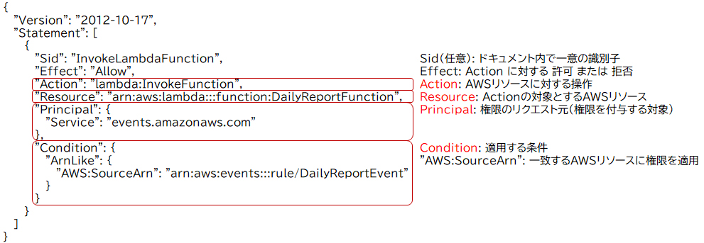
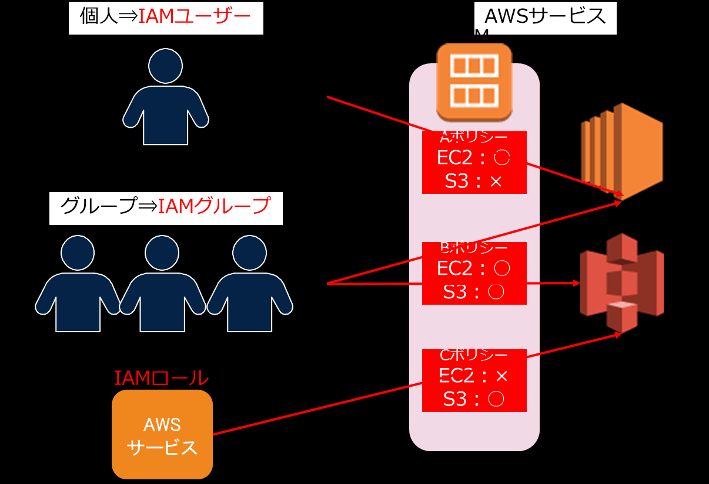
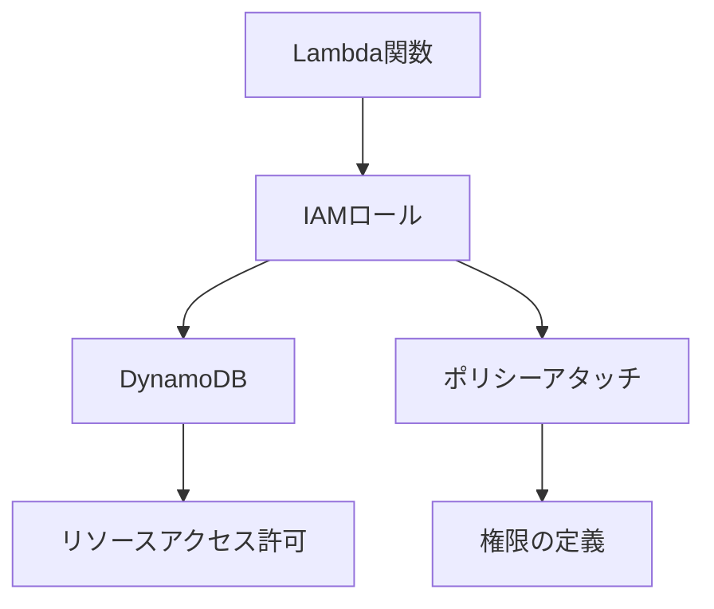

# IAM




# AWS LambdaとIAMロールの関係：DynamoDBアクセス権限の設定方法

## 概要

AWS Lambdaを利用してDynamoDBなどのAWSリソースにアクセスする場合、正しい権限設定が不可欠です。本記事では、Lambda関数とIAMロールの関係、そしてLambdaがDynamoDBにアクセスするための適切な権限設定方法について詳しく解説します。

---

## 1. AWS LambdaとIAMロールの基本メカニズム

### 1.1 AWS Lambdaとは

AWS Lambdaは、サーバーレスのコンピューティングサービスであり、コードを実行するためのインフラ管理が不要です。Lambda関数は、イベントに応じてトリガーされ、コードを実行します。Lambda関数は他のAWSサービスと連携して動作することが多いため、適切なアクセス権限の設定が重要です。

### 1.2 IAMロールとは

IAMロール（Identity and Access Management Role）は、AWSリソースに対して権限を付与するために使用される「仮想的なユーザー」です。IAMロールは、特定のアクションを実行する権限を持ち、その権限を他のAWSリソース（例えば、Lambda関数）に付与するために使用されます。

---

## 2. Lambda関数とDynamoDBのアクセス権限の設定

### 2.1 正しい権限設定の重要性

Lambda関数がDynamoDBにアクセスするためには、IAMロールを使用して適切な権限を設定する必要があります。このIAMロールは、Lambda関数がDynamoDBで特定のアクション（読み取り、書き込みなど）を実行するためのアクセス許可を持っています。

### 2.2 IAMロールの設定手順

**手順1**: IAMロールの作成  
AWS Management ConsoleからIAMロールを作成します。ロールの種類として「Lambda」を選択し、信頼されたエンティティとして「Lambda」を指定します。

**手順2**: ポリシーのアタッチ  
IAMロールに対して、DynamoDBへのアクセス権限を定義したIAMポリシーをアタッチします。以下は、DynamoDBへの読み書き権限を付与するポリシーの例です。

```json
{
  "Version": "2012-10-17",
  "Statement": [
    {
      "Effect": "Allow",
      "Action": [
        "dynamodb:PutItem",
        "dynamodb:GetItem",
        "dynamodb:UpdateItem"
      ],
      "Resource": "arn:aws:dynamodb:us-west-2:123456789012:table/YourTableName"
    }
  ]
}
```

**手順3**: Lambda関数へのロールの適用  
作成したIAMロールをLambda関数に適用します。これにより、Lambda関数は指定されたDynamoDBテーブルにアクセスできるようになります。

### 2.3 間違いやすいポイント

- **IAMユーザーの使用**: Lambda関数に対してIAMユーザーを設定しても、リソースに対する権限を付与することはできません。IAMロールを使用する必要があります。
- **IAMポリシーのみの設定**: IAMポリシーは権限を定義するものであり、これを適用するにはIAMロールを通じてLambda関数に付与する必要があります。
- **バケットポリシーの誤用**: S3バケットへのアクセスを制御するためのバケットポリシーは、DynamoDBアクセスのためのLambda関数には適用されません。

---

## 3. まとめ

### 適切な権限設定の流れ（Mermaid.js）



### ポイントまとめ

| 設定項目          | 説明                                                                         | 注意点                                        |
|-------------------|------------------------------------------------------------------------------|-----------------------------------------------|
| IAMロール          | Lambda関数に権限を付与するための仮想ユーザー                                 | IAMユーザーではなく、IAMロールを使用する       |
| IAMポリシー        | リソースアクセス権限を定義する文書                                           | ポリシーをIAMロールにアタッチする必要がある   |
| バケットポリシー   | S3バケットへのアクセス制御用                                                 | DynamoDBへのアクセスには関係がない           |

---

AWS Lambdaを利用して他のAWSリソースにアクセスする際には、適切なIAMロールを設定することが不可欠です。今回の解説で、Lambda関数がDynamoDBにアクセスするための正しい権限設定について理解が深まったと思います。明日の試験に向けて、この知識をしっかりと復習し、成功を収められることを願っています。