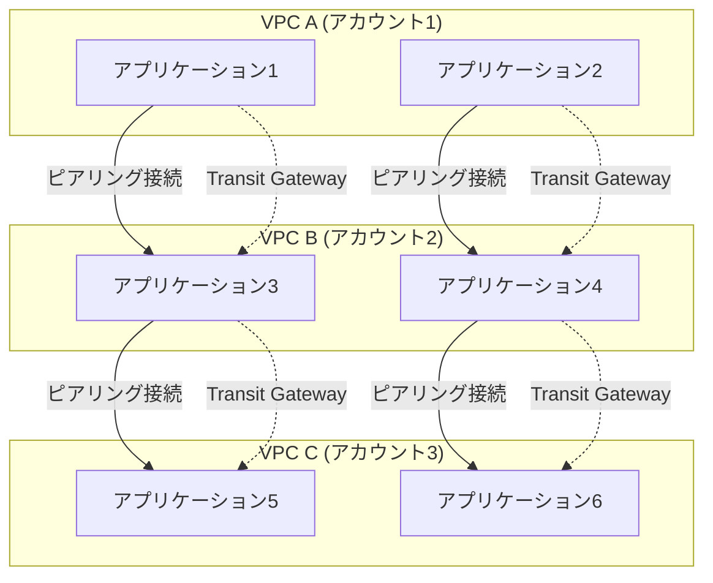
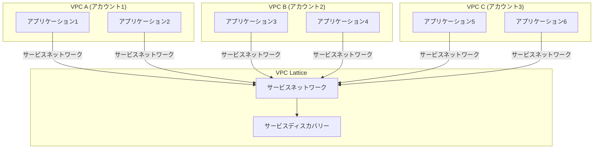
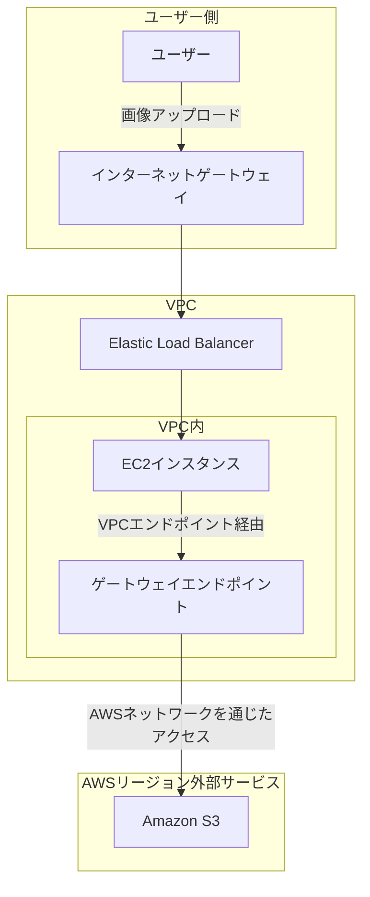

# VPC
以下に、従来のVPCサービスとAmazon VPC Latticeの違いをアーキテクチャ図で示します。Mermaidを使用して、各アプローチの構造を視覚的に説明します。

### 1. **従来のVPCサービス（VPCピアリング + Transit Gateway）**

### 2. **Amazon VPC Lattice**

### 3. **図解の説明**

#### **従来のVPCサービス（VPCピアリング + Transit Gateway）**
- **VPCピアリング**:
  - VPC間を1対1で接続します。VPCが増えると接続が複雑になります。
  - 各アプリケーション間の通信が直接接続されるため、管理が煩雑になります。

- **Transit Gateway**:
  - 複数のVPCを集中的に接続し、ルーティングを統合します。
  - 各VPCのアプリケーションはTransit Gatewayを経由して通信できますが、サービスディスカバリーは手動で設定する必要があります。

#### **Amazon VPC Lattice**
- **VPC Lattice**:
  - 各VPC内のアプリケーションをサービスネットワークに統合し、VPC Latticeを介して通信を一元管理します。
  - **サービスディスカバリー**が組み込まれており、アプリケーション間の通信が自動的に管理されます。
  - マルチアカウントやマルチVPCにまたがるマイクロサービスアーキテクチャを簡素化します。

### 4. **まとめ**

- **従来のVPCサービス**では、複数のVPC間の通信が複雑で、サービスディスカバリーも手動で設定する必要があります。
- **Amazon VPC Lattice**は、通信管理とサービスディスカバリーを一元化し、マルチアカウント・マルチVPCの環境でも簡素に管理できます。

このアーキテクチャ図を通じて、従来のVPCサービスとAmazon VPC Latticeの違いを視覚的に理解することができます。

以下に、ユーザからのリクエストがどのように処理されるかを含めた図解を追加します。

# Amazon S3とVPCエンドポイントを活用したコスト効率の高いデータ転送

## はじめに

AWS上で画像共有アプリケーションを運用する際、EC2インスタンスとS3バケット間でのデータ転送コストを削減することは重要です。本記事では、**VPCエンドポイント**を活用して、コスト効率を高める方法について解説します。

## シナリオの概要

ある企業は、AWS上で画像共有アプリケーションを運用しています。このアプリケーションでは、EC2インスタンスから同じAWSリージョン内にある複数のAmazon S3バケットに画像をアップロードおよびダウンロードしています。しかし、このデータ転送によるコストが増加しているため、コスト削減のための対策が必要です。

### 誤解答選択と正しい選択

**誤解答選択**:
- **インターフェースエンドポイントをパブリックサブネットにデプロイする**
- **インターネットゲートウェイ経由でS3バケットにアクセスする**

**正しい選択**:
- **インターフェースエンドポイントをプライベートサブネットに配置し、エンドポイントポリシーをアタッチする**
- **ゲートウェイエンドポイントをVPCに配置し、エンドポイントポリシーをアタッチする**

## VPCエンドポイントの概要

### ゲートウェイエンドポイント

**ゲートウェイエンドポイント**は、VPC内のリソースからAmazon S3やDynamoDBなどのAWSサービスへのアクセスを可能にするエンドポイントです。これにより、インターネットゲートウェイやNATデバイスを通さずに、VPC内から直接S3にアクセスできるため、データ転送コストを削減できます。

- **利用シナリオ**: VPC内のEC2インスタンスが、S3バケットにアクセスする際に使用されます。
- **設定**: VPCのルートテーブルにゲートウェイエンドポイントのルートを追加し、S3バケットへのアクセスを許可するエンドポイントポリシーを設定します。

### インターフェースエンドポイント

**インターフェースエンドポイント**は、AWS PrivateLinkを使用して、VPC内から他のAWSサービス（今回の例ではS3）にアクセスするためのプライベートエンドポイントです。プライベートIPを使用して通信するため、セキュリティが強化されます。

- **利用シナリオ**: S3に対するよりセキュアなアクセスが必要な場合に利用されます。
- **設定**: プライベートサブネットにインターフェースエンドポイントを配置し、エンドポイントポリシーを設定します。

## 図解: ユーザからのリクエストを含むVPCエンドポイントを使用したS3への効率的なアクセス

### 図解の説明

1. **ユーザのリクエスト**:
   - ユーザーはインターネットを介して画像をアップロードします。このリクエストはインターネットゲートウェイ（IGW）を経由して、VPC内のElastic Load Balancer（ELB）に届きます。

2. **EC2インスタンスへの配信**:
   - ELBはリクエストをVPC内のEC2インスタンスに配信し、EC2インスタンスで画像を処理します。

3. **S3バケットへのデータ転送**:
   - EC2インスタンスが処理した画像データは、VPCエンドポイントを使用してAmazon S3バケットに保存されます。ここでは、ゲートウェイエンドポイントとインターフェースエンドポイントの2つのオプションがあり、どちらもインターネットを介さずにデータを転送できます。

   - **ゲートウェイエンドポイント**は、VPC内のルートテーブルを介してS3バケットへのアクセスを提供し、インターネットを使用せずにコストを削減します。
   
   - **インターフェースエンドポイント**は、プライベートサブネット内に配置され、プライベートIPを使用してS3バケットにアクセスします。これにより、セキュリティが強化されます。

## 不適切な選択肢の解説

### 1. インターフェースエンドポイントをパブリックサブネットにデプロイ
インターフェースエンドポイントをパブリックサブネットにデプロイする場合、セキュリティ上の利点が失われ、コスト削減効果が低減します。インターフェースエンドポイントはプライベートサブネットに配置するのが適切です。

### 2. インターネットゲートウェイ経由でのアクセス
インターネットゲートウェイ経由でS3バケットにアクセスすることも可能ですが、データ転送コストが増加します。ゲートウェイエンドポイントを使用することで、これらのコストを回避できます。

## まとめ

AWSでEC2インスタンスとS3バケット間のデータ転送コストを削減するためには、**ゲートウェイエンドポイント**や**インターフェースエンドポイント**を適切に設定することが重要です。これにより、インターネットを介さずにVPC内からS3にアクセスできるようになり、通信料金を大幅に削減することが可能です。AWS SAA試験において、これらの設定方法とその効果を理解することが、ネットワークコスト管理に関する問題を解答する際に役立つでしょう。