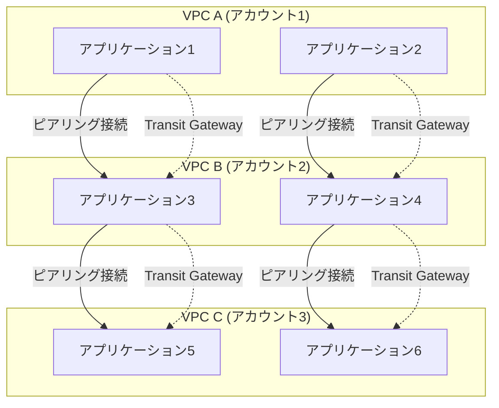
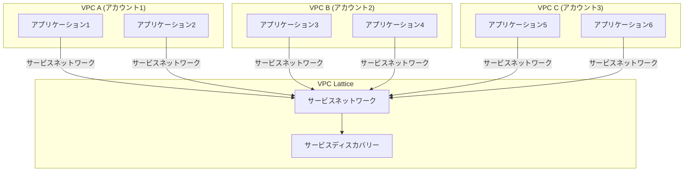

# VPC
以下に、従来のVPCサービスとAmazon VPC Latticeの違いをアーキテクチャ図で示します。Mermaidを使用して、各アプローチの構造を視覚的に説明します。

### 1. **従来のVPCサービス（VPCピアリング + Transit Gateway）**

### 2. **Amazon VPC Lattice**

### 3. **図解の説明**

#### **従来のVPCサービス（VPCピアリング + Transit Gateway）**
- **VPCピアリング**:
  - VPC間を1対1で接続します。VPCが増えると接続が複雑になります。
  - 各アプリケーション間の通信が直接接続されるため、管理が煩雑になります。

- **Transit Gateway**:
  - 複数のVPCを集中的に接続し、ルーティングを統合します。
  - 各VPCのアプリケーションはTransit Gatewayを経由して通信できますが、サービスディスカバリーは手動で設定する必要があります。

#### **Amazon VPC Lattice**
- **VPC Lattice**:
  - 各VPC内のアプリケーションをサービスネットワークに統合し、VPC Latticeを介して通信を一元管理します。
  - **サービスディスカバリー**が組み込まれており、アプリケーション間の通信が自動的に管理されます。
  - マルチアカウントやマルチVPCにまたがるマイクロサービスアーキテクチャを簡素化します。

### 4. **まとめ**

- **従来のVPCサービス**では、複数のVPC間の通信が複雑で、サービスディスカバリーも手動で設定する必要があります。
- **Amazon VPC Lattice**は、通信管理とサービスディスカバリーを一元化し、マルチアカウント・マルチVPCの環境でも簡素に管理できます。

このアーキテクチャ図を通じて、従来のVPCサービスとAmazon VPC Latticeの違いを視覚的に理解することができます。
