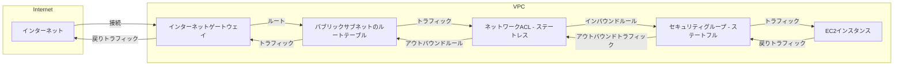

もちろんです。以下に、ステートフルとステートレスの違いを図解した上で、SSH接続の流れを説明します。

# ステートフルとステートレスの違いとSSH接続の設定方法

## タイトル: ステートフルとステートレスの違いを理解してAWSのSSH接続設定を行う

### はじめに

AWSでEC2インスタンスにSSH接続をする際、セキュリティグループやネットワークACLの設定が正しく行われている必要があります。特に、セキュリティグループがステートフルであり、ネットワークACLがステートレスであることを理解することが重要です。

### ステートフルとステートレスの違い

#### ステートフル（Stateful）

- **意味**: 一度許可された接続（インバウンドまたはアウトバウンド）に対する応答は自動的に許可されます。
- **例**: AWSのセキュリティグループはステートフルです。インバウンドルールで許可された接続は、アウトバウンドトラフィックも自動的に許可されます。

#### ステートレス（Stateless）

- **意味**: 接続の状態を保持せず、インバウンドとアウトバウンドのトラフィックを個別に管理する必要があります。
- **例**: AWSのネットワークACLはステートレスです。インバウンドとアウトバウンドの両方で個別に許可ルールを設定する必要があります。

### SSH接続の設定

#### シナリオの問題点
- **EC2インスタンスにSSH接続ができない**: パブリックIPが付与され、セキュリティグループやネットワークACLも設定されているのに、SSH接続ができない。

#### 解決策
- **ネットワークACLのアウトバウンドルールにエフェメラルポート（1024-65535）を許可**: ステートレスなネットワークACLにおいて、アウトバウンドトラフィックを許可するルールが必要です。

### 図解: ステートフルとステートレスの違いとSSH接続の流れ

### 図解の説明

1. **インターネットからの接続**: インターネットからのトラフィックがインターネットゲートウェイを通じてVPCに入ります。
2. **ルートテーブルの確認**: パブリックサブネットのルートテーブルがインターネットゲートウェイへのルートを持っていることを確認します。
3. **ネットワークACLの処理**: ステートレスなネットワークACLがトラフィックをインバウンドおよびアウトバウンドで個別に許可します。ここで、アウトバウンドでエフェメラルポートを許可するルールが必要です。
4. **セキュリティグループの処理**: ステートフルなセキュリティグループがインバウンドトラフィックを許可し、その後のアウトバウンドトラフィックも自動的に許可します。
5. **EC2インスタンスへの接続**: トラフィックがEC2インスタンスに到達し、SSH接続が確立されます。

### まとめ

AWSでのEC2インスタンスへのSSH接続を確立する際、ネットワーク設定においてステートフルとステートレスの違いを理解し、正しく設定することが重要です。特に、ネットワークACLにおいては、インバウンドだけでなくアウトバウンドのルールも設定する必要があります。AWS SAA試験では、これらの概念をしっかり理解しておくことがポイントです。